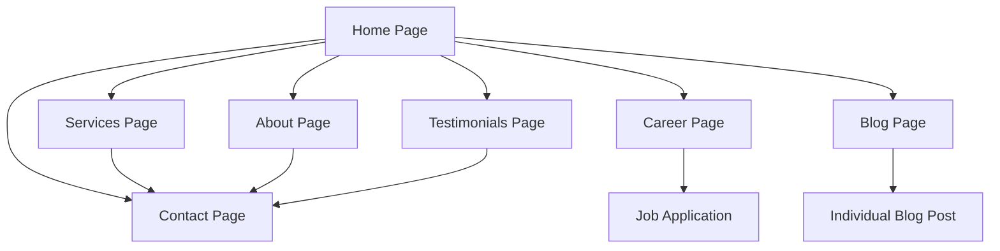

# Insignyx Technologies Website - Product Requirements Document

## 1. Product Overview
A modern, professional website for Insignyx Technologies, a leading software development and IT consulting company specializing in AI implementation, cloud migration services, and big data solutions.

The website will serve as the primary digital presence to showcase expertise, attract potential clients, and establish credibility in the competitive tech consulting market. Target audience includes enterprise clients, startups, and organizations seeking digital transformation solutions.

## 2. Core Features

### 2.1 User Roles
| Role | Registration Method | Core Permissions |
|------|---------------------|------------------|
| Website Visitor | No registration required | Can browse all pages, view content, submit contact forms |
| Blog Reader | Optional email subscription | Can read blog posts, subscribe to newsletter |

### 2.2 Feature Module
Our Insignyx Technologies website consists of the following main pages:
1. **Home Page**: Hero section with video background, company overview, key services showcase, client testimonials preview, call-to-action sections
2. **About Page**: Company story, team profiles, mission and vision, company values, achievements and certifications
3. **Services Page**: Detailed service offerings, AI implementation solutions, cloud migration expertise, big data consulting, technology stack showcase
4. **Contact Page**: Contact form, office locations, contact information, interactive map, business hours
5. **Career Page**: Job listings, company culture, benefits, application process, team photos
6. **Testimonials Page**: Client success stories, case studies, client logos, detailed project outcomes
7. **Blog Page**: Technical articles, industry insights, company updates, search and filter functionality

### 2.3 Page Details
| Page Name | Module Name | Feature Description |
|-----------|-------------|--------------------|
| Home Page | Hero Section | Display company tagline with full-screen background video, animated text overlays, call-to-action buttons |
| Home Page | Services Overview | Showcase three main service areas (AI, Cloud, Big Data) with icons, brief descriptions, and hover animations |
| Home Page | Client Testimonials | Rotating testimonial cards with client photos, company logos, and success metrics |
| Home Page | Statistics Counter | Animated counters showing projects completed, clients served, years of experience |
| About Page | Company Story | Timeline of company growth, founder profiles, company milestones with interactive elements |
| About Page | Team Section | Team member cards with photos, roles, expertise areas, and social media links |
| About Page | Values & Mission | Company values with icons, mission statement, vision for the future |
| Services Page | AI Implementation | Detailed AI services including machine learning, automation, chatbots, with case study examples |
| Services Page | Cloud Migration | AWS and Azure migration services, cloud architecture, security, cost optimization details |
| Services Page | Big Data Solutions | Data analytics, data warehousing, business intelligence, real-time processing capabilities |
| Services Page | Technology Stack | Interactive showcase of technologies, frameworks, and tools used |
| Contact Page | Contact Form | Multi-step contact form with service selection, project details, file upload capability |
| Contact Page | Location Info | Interactive map, multiple office locations, contact details, business hours |
| Career Page | Job Listings | Current openings with detailed descriptions, requirements, application process |
| Career Page | Company Culture | Office photos, team events, benefits package, work environment showcase |
| Testimonials Page | Success Stories | Detailed case studies with before/after metrics, client interviews, project timelines |
| Testimonials Page | Client Logos | Grid of client company logos with hover effects and brief project descriptions |
| Blog Page | Article Listing | Blog post grid with featured images, excerpts, author info, publication dates |
| Blog Page | Search & Filter | Search functionality, category filters, tag-based filtering, pagination |

## 3. Core Process
The main user journey begins with visitors landing on the homepage where they are immediately engaged by the hero video and company overview. Users can navigate to specific service pages to understand Insignyx's expertise in AI, cloud migration, or big data solutions. Interested prospects can contact the company through the detailed contact form or explore career opportunities. The blog section provides ongoing value through technical insights and industry updates.

## 4. User Interface Design
### 4.1 Design Style
- **Primary Colors**: Deep blue (#1a365d), bright cyan (#00d4ff), white (#ffffff)
- **Secondary Colors**: Dark gray (#2d3748), light gray (#f7fafc), accent orange (#ff6b35)
- **Button Style**: Modern rounded buttons with gradient effects and hover animations
- **Typography**: Inter font family, 16px base size, bold headings with 32-48px sizes
- **Layout Style**: Clean, modern card-based design with generous white space, sticky navigation
- **Icons**: Feather icons and custom tech-focused iconography with subtle animations

### 4.2 Page Design Overview
| Page Name | Module Name | UI Elements |
|-----------|-------------|-------------|
| Home Page | Hero Section | Full-screen background video, overlay gradient, animated typography, floating call-to-action buttons |
| Home Page | Services Cards | Three-column grid, hover lift effects, gradient backgrounds, icon animations |
| About Page | Team Grid | Four-column responsive grid, circular profile photos, card flip animations on hover |
| Services Page | Service Details | Tabbed interface, interactive diagrams, technology logos, before/after comparisons |
| Contact Page | Contact Form | Multi-step wizard, progress indicator, field validation, success animations |
| Career Page | Job Cards | List view with expandable details, filter sidebar, application modal |
| Blog Page | Article Grid | Masonry layout, featured post highlighting, infinite scroll, social sharing buttons |

### 4.3 Responsiveness
The website is mobile-first responsive design with breakpoints at 768px (tablet) and 1024px (desktop). Touch-optimized interactions for mobile devices, with swipe gestures for testimonial carousels and image galleries. Progressive web app features for improved mobile performance.